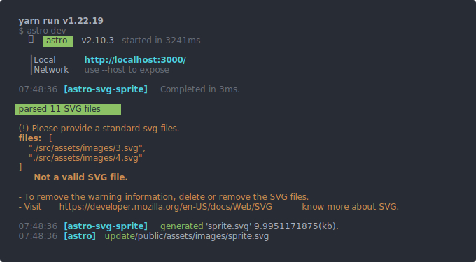

<div align="center">

**Latest Updates! 🎉 See the [change log](./CHANGELOG.md) for details.**


# stro-svg-sprite

A zero-dependency [Astro Integration](https://docs.astro.build/en/guides/integrations-guide/) that generates a sprite.svg from SVG files in your Astro project.

</div>

## Installation

> This package is compatible with Astro 2.0 and above, which support the Integrations API.

To automate the installation, use the `astro add` command-line tool. You can initialize it via `npx`, `yarn`, or `pnpm` based on your preference.

```sh
npx astro add astro-svg-sprite
```

Alternatively, you can manually install it by running the following command in your terminal:

```sh
npm install astro-svg-sprite
```

## Usage

<details>
<summary id="#getting-started"><b>Getting Started</b></summary>
<br>

Add astro-svg-sprite to your `astro.config.*` file:

```ts
// astro.config.mjs
import { defineConfig } from "astro/config";
import svgSprite from "astro-svg-sprite";

export default defineConfig({
  integrations: [svgSprite()],
});
```

Store the SVG files to be used for the generated `sprite.svg` in the `src/assets/images/sprite` directory.

```
/
├── astro.config.mjs
├── public
|   └── assets
|       └── images
|           └── sprite.svg
├── src
|   └── assets
|       └── images
|           └── sprite
|               └── 1.svg
|               └── 2.svg
|               └── *.svg
├── tsconfig.json
├── package.json
```

Generating the `sprite.svg` on build:

```sh
npm run dev
```

or

```sh
npm run build
```

The `sprite.svg` will be output to `public/assets/images` directory.



To use the generated `sprite.svg` file, create a `Sprite` component at `components/Sprite.astro`:

```astro
---
export interface props {
  name: string;
}

const { class:className, name } = Astro.props;
---
<svg class={className}>
  <use xlink:href=`${Astro.site}assets/images/sprite.svg#${name}`></use>
</svg>
```

Then call the `Sprite.astro` component on other pages.

```astro
---
import Sprite from 'components/Sprite.astro'
---
<Sprite name="fileName" class="customClassName"/>
```

</details>

<details>
<summary><b>Advanced</b></summary>
<br>

Here is an example of an advanced full configuration. With the help of [JSDoc](./dist/index.d.ts), you can easily configure it.

```ts
// astro.config.mjs
import { defineConfig } from "astro/config";
import svgSprite from "astro-svg-sprite";

export default defineConfig({
  integrations: [
    svgSprite({
      mode: "verbose",
      include: [
        "./src/assets/images/sprite",
        "./src/assets/images",
        "./src/assets",
      ],
      emitFile: {
        compress: "standard",
        path: "assets/images",
      },
    }),
  ],
});
```

> **Note:** `emitFile.compress` recommends using the default `standard` mode. The `best` mode will convert some svg tags into path tags.

</details>

## Need Help or Feedback?

Submit your issues or feedback on our [GitHub](https://github.com/ACP-CODE/astro-svg-sprite/issues) channel.

## Changelog

See [CHANGELOG.md](CHANGELOG.md) for a history of changes to this Integration.
